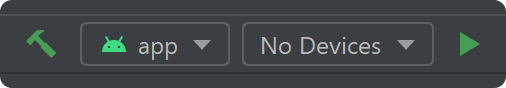

See the overview of the project at https://attestation.app/about.

## Development Environment

**Auditor** uses the Gradle build system and can be imported directly into Android Studio.

Change the run configuration to `app`.



NOTE: Building the app on macOS or Windows will require updating the dependency checksums in `gradle/verification-metadata.xml`.
Execute the following command:

```
./gradlew --write-verification-metadata sha512 build
```